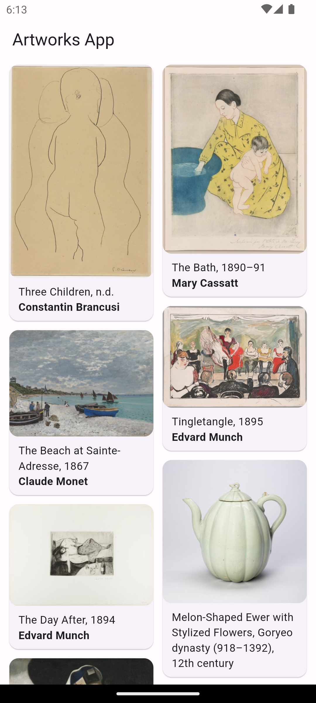
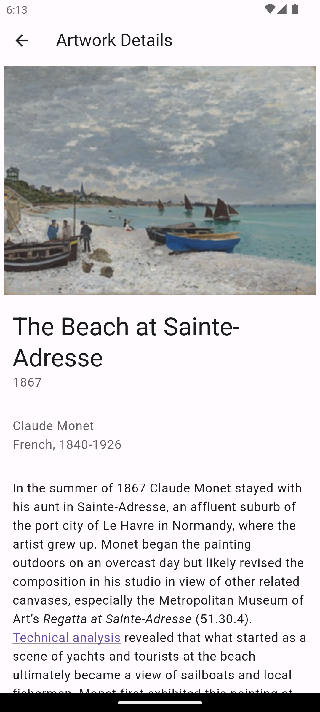

# Artworks - Mobile Application Development Course Project

# English

Artworks is a mobile application for listing all the artworks provided by the [The Art Institute of Chicago](https://www.artic.edu/). API documentation can be found on: [API Documentation](https://api.artic.edu/docs).

## About

This project is built as ```Mobile Application Development``` course project for Spring term in Erciyes University. The application offers a grid of artwork images provided by the API. When a user wants to see a detailed information about this artwork; they click to the image and the user is navigated to a detail page with hero animation.

## How to Use

Step 1

Download or clone this repo by using the link below:

```
https://github.com/ahmetozrahat/artworks-mobile
```

Step 2

In the project root folder execute this command to get project dependencies.

```
flutter pub get
```

Step 3

Project uses ```freezed``` and ```json_serializable``` packages in order to parse API responses into data classes. For generating the needed files you can issue this command:

```
dart run build_runner build --delete-conflicting-outputs
```

or you can watch for changes and keep the code in sync with changes:

```
dart run build_runner watch
```

> Note: There is a known issue when using ```freezed``` and ```json_seriliazable``` packages together the linter causes warnings for data annotations. You can fix this issue by adding these lines to your ```analysis_options.yaml``` file:

```
analyzer:
  exclude:
    - "**/*.g.dart"
    - "**/*.freezed.dart"
  errors:
    invalid_annotation_target: ignore
```

## Hide Generated Files

In-order to hide generated files, navigate to `Android Studio` -> `Preferences` -> `Editor` -> `File Types` and paste the below lines under `ignore files and folders` section:

```
*.freezed.dart;*.g.dart;
```

## Packages

This project built with these packages:

- [bloc](https://pub.dev/packages/bloc) as state management
- [cached_network_image](https://pub.dev/packages/cached_network_image) for caching the images
- [dio](https://pub.dev/packages/dio) for making HTTP requests
- [easy_localization](https://pub.dev/packages/easy_localization) for localizing the apps
- [freezed](https://pub.dev/packages/freezed) for creating data models
- [infinite_scroll_pagination](https://pub.dev/packages/infinite_scroll_pagination) for paginating through data
- [get_it](https://pub.dev/packages/get_it) for dependency injection

## Screenshots




## Features

- Displaying artworks.
- Showing detailed information about artworks.

## Roadmap

- 🔲 Searching through content on the home page.
- 🔲 Searchbar on the home page for searching the content.
- 🔲 Favorites page for adding artworks to favorites.
- 🔲 Share button for sharing the artwork.

# Türkçe

Artworks, [Chicago Sanat Enstitüsü](https://www.artic.edu/) tarafından sağlanan tüm sanat eserlerini listelemek için bir mobil uygulamadır. API belgelerine [API Documentation](https://api.artic.edu/docs) adresinden ulaşılabilir.

## Hakkında

Bu proje, Erciyes Üniversitesi'nde Bahar dönemi "Mobil Uygulama Geliştirme" dersi projesi olarak oluşturulmuştur. Uygulama, API tarafından sağlanan sanat eseri görüntülerinden oluşan bir ızgara sunar. Bir kullanıcı, bu sanat eseri hakkında ayrıntılı bilgi görmek istediğinde, görüntüye tıklayarak hero animasyonu ile detay sayfasına yönlendirilir.

## Nasıl Kullanılır

Adım 1

Aşağıdaki linki kullanarak bu repoyu indirin veya klonlayın:

```
https://github.com/ahmetozrahat/artworks-mobile
```

Step 2

Proje kök dizininde, proje bağımlılıklarını almak için bu komutu çalıştırın.

```
flutter pub get
```

Step 3

Proje, API yanıtlarını veri sınıflarına ayrıştırmak için ```freezed``` ve ```json_serializable``` paketlerini kullanır. Gerekli dosyaları oluşturmak için bu komutu çalıştırabilirsiniz:

```
dart run build_runner build --delete-conflicting-outputs
```

veya değişiklikleri izleyip kodu değişikliklerle senkronize tutabilirsiniz:

```
dart run build_runner watch
```

> Not: ```freezed``` ve ```json_serializable``` paketlerini birlikte kullanırken bilinen bir sorun, linterin veri ek açıklamaları için uyarılar vermesine neden olur. Bu sorunu çözmek için ```analysis_options.yaml``` dosyanıza şu satırları ekleyebilirsiniz:

```
analyzer:
  exclude:
    - "**/*.g.dart"
    - "**/*.freezed.dart"
  errors:
    invalid_annotation_target: ignore
```

## Oluşturulan Dosyaları Gizle

Oluşturulan dosyaları gizlemek için, `Android Studio` -> `Preferences` -> `Editor` -> `File Types` yolunu izleyin ve aşağıdaki satırları `ignore files and folders` bölümüne yapıştırın:

```
*.freezed.dart;*.g.dart;
```

## Paketler

Bu proje aşağıdaki paketler kullanılarak oluşturulmuştur:

- Durum yönetimi için [bloc](https://pub.dev/packages/bloc)
- Görüntülerin önbelleğe alınması için [cached_network_image](https://pub.dev/packages/cached_network_image)
- HTTP istekleri yapmak için [dio](https://pub.dev/packages/dio)
- Uygulamaları yerelleştirmek için [easy_localization](https://pub.dev/packages/easy_localization)
- Veri modelleri oluşturmak için [freezed](https://pub.dev/packages/freezed)
- Verileri sayfalara ayırmak için [infinite_scroll_pagination](https://pub.dev/packages/infinite_scroll_pagination)
- Dependency injection için [get_it](https://pub.dev/packages/get_it)

## Ekran Görüntüleri


## Özellikler

- Sanat eserlerini görüntüleme.
- Sanat eserleri hakkında ayrıntılı bilgi gösterme.

## Yol Haritası

- 🔲 Ana sayfada içerik araması yapma.
- 🔲 İçerik aramak için ana sayfada arama çubuğu.
- 🔲 Sanat eserlerini favorilere eklemek için favoriler sayfası.
- 🔲 Sanat eserini paylaşmak için paylaşım butonu.
